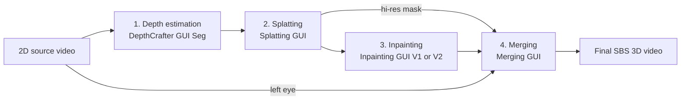

# StereoCrafter GUI Suite

**A heavily modified fork of [TencentARC/StereoCrafter](https://github.com/TencentARC/StereoCrafter) — a complete, GUI-driven 2D-to-stereoscopic-3D video conversion pipeline for Windows.**

The original research code has been rebuilt into a suite of five batch-capable desktop GUIs covering every stage of the conversion: video depth estimation, depth-based splatting, diffusion inpainting of the right-eye view, and final high-quality stereo assembly. Output can be viewed on 3D displays, 3D glasses, Apple Vision Pro, Quest, and similar devices.

<div align="center">
    
</div>

---

## ✨ What this fork adds

- **Five full-featured Tkinter GUIs** replacing the original CLI scripts — all with batch folder processing, resume support, live previews, tooltips, dark mode, and persistent settings.
- **Modern environment**: [uv](https://docs.astral.sh/uv/)-managed Python 3.13, PyTorch 2.13 (CUDA 13), diffusers 0.36 — installed with one command, no CUDA Toolkit or compiler required.
- **Fast attention**: cuDNN SDPA enabled automatically, plus optional [SageAttention 2.2](https://github.com/thu-ml/SageAttention) (prebuilt Windows wheel, installed automatically) with per-GUI toggles — up to ~2× faster UNet attention on top of cuDNN at 1080p tile sizes, with sub-1% numeric deviation.
- **Segment-based depth workflow** with per-segment resume, seamless merging (shift & scale or linear blend alignment), and MP4 / PNG / EXR / NPZ outputs.
- **Advanced splatting**: forward-warp and mesh-warp modes, auto-convergence (average / peak / hybrid), dual- or quad-panel outputs, full-res + low-res passes, sidecar JSON settings per clip, multi-depth-map comparison, and live SBS preview.
- **Two inpainting backends**: the original SVD-based StereoCrafter model (V1) and the Wan 2.1 VACE-based StereoCrafter2 transformer (V2), each with its own GUI. V2 offers selectable CPU-offload modes — including a fully GPU-resident **FP8-quantized** option for ~20 GB+ cards.
- **Dedicated Merging GUI** for final assembly: blends the inpainted right eye with the original left eye using the hi-res occlusion mask, with mask feathering, shadow controls, color transfer, and professional encoding options.
- **1-click installer and updater** for Windows.

---

## 🧭 Pipeline overview



| Stage | GUI | Launcher | In → Out (defaults) |
|---|---|---|---|
| 1. Depth estimation | `depthcrafter_gui_seg.py` | `_RUN_DepthCrafter_GUI_Seg.bat` | `input_clips/` → `output_depthmaps/` |
| 2. Splatting | `splatting_gui.py` | `_RUN_Splatting_GUI.bat` | clips + depth maps → `output_splatted/` |
| 3. Inpainting (V1, SVD) | `inpainting_gui.py` | `_RUN_Inpainting_GUI.bat` | `output_splatted/` → `completed_output/` |
| 3. Inpainting (V2, Wan VACE) | `inpainting_gui_v2.py` | `_RUN_Inpainting_GUI_V2.bat` | `output_splatted/` → `completed_output/` |
| 4. Merging | `merging_gui.py` | `_RUN_Merging_GUI.bat` | inpainted + original + mask → final SBS |

Each launcher activates the project environment and, on multi-GPU systems, lets you pick which GPU to use.

---

## 📋 Requirements

- **Windows 10/11** with an **NVIDIA GPU** (16 GB VRAM recommended; smaller cards work with CPU offload and tiling — the V2 / Wan 14B workflow is significantly heavier than V1)
- A recent **NVIDIA driver** (CUDA 13 capable, version 580+ — check with `nvidia-smi`). The CUDA Toolkit is **not** required.
- **[Git](https://git-scm.com/downloads/win)** on PATH
- **[FFmpeg](https://techtactician.com/how-to-install-ffmpeg-and-add-it-to-path-on-windows/)** on PATH

---

## 🛠️ Installation

### Option 1: 1-click installer (recommended)

Download and run [`_install/StereoCrafter_1click_Installer.bat`](_install/StereoCrafter_1click_Installer.bat) from the folder where you want StereoCrafter installed. It installs Git and uv if missing, clones the repository, sets up the Python environment (`uv sync`), and offers to download the model weights.

### Option 2: Manual install

Follow the [Manual Installation Guide](_install/StereoCrafter_Manual_Install.md). The short version:

```bash
git clone --recursive https://github.com/enoky/StereoCrafter.git
cd StereoCrafter
uv sync
```

### Updating

Run [`_update.bat`](_update.bat) in the project root to pull the latest code and re-sync the environment.

---

## 📦 Model weights

All weights live under `./weights/`. The installer can download the core set for you; to do it manually, first accept the terms on the [SVD XT 1.1 page](https://huggingface.co/stabilityai/stable-video-diffusion-img2vid-xt-1-1) (gated model), log in with `uv run hf auth login`, then:

```bash
uv run hf download stabilityai/stable-video-diffusion-img2vid-xt-1-1 --local-dir weights/stable-video-diffusion-img2vid-xt-1-1
uv run hf download tencent/DepthCrafter --local-dir weights/DepthCrafter
uv run hf download TencentARC/StereoCrafter --local-dir weights/StereoCrafter
```

For the optional V2 (Wan VACE) inpainting backend (the `--include` skips the base repo's own ~28 GB transformer, which SC uses none of):

```bash
uv run hf download Wan-AI/Wan2.1-VACE-14B-diffusers --include "tokenizer/*" "text_encoder/*" "vae/*" --local-dir weights/Wan2.1-VACE-14B-diffusers
uv run hf download TencentARC/StereoCrafter2 --local-dir weights/StereoCrafter2
```

For the V2 "FP8 resident" mode (20 GB+ VRAM GPUs; can replace the bf16 transformer above entirely):

```bash
uv run hf download enoky/StereoCrafter2-FP8 --local-dir weights/StereoCrafter2-FP8
```

| Model | Used by | Target folder |
|---|---|---|
| [SVD img2vid-xt-1-1](https://huggingface.co/stabilityai/stable-video-diffusion-img2vid-xt-1-1) (gated) | Depth + V1 inpainting | `weights/stable-video-diffusion-img2vid-xt-1-1` |
| [DepthCrafter](https://huggingface.co/tencent/DepthCrafter) | Depth estimation | `weights/DepthCrafter` |
| [StereoCrafter](https://huggingface.co/TencentARC/StereoCrafter) | V1 inpainting | `weights/StereoCrafter` |
| [Wan 2.1 VACE 14B (diffusers)](https://huggingface.co/Wan-AI/Wan2.1-VACE-14B-diffusers) | V2 inpainting (optional) | `weights/Wan2.1-VACE-14B-diffusers` |
| [StereoCrafter2](https://huggingface.co/TencentARC/StereoCrafter2) | V2 inpainting (optional) | `weights/StereoCrafter2` |
| [StereoCrafter2 FP8](https://huggingface.co/enoky/StereoCrafter2-FP8) | V2 "FP8 resident" mode (optional; ~20 GB+ VRAM GPUs) | `weights/StereoCrafter2-FP8` |

The FP8 checkpoint can also be generated locally from `weights/StereoCrafter2` with `uv run python export_fp8_transformer.py` (needs ~64 GB system RAM; the download needs only ~17 GB).

Total size for the core set is roughly 22 GB. A torrent of the core weights is also available [here](https://mega.nz/file/Fw1GgJrL#bPplu2Y1PT4G-TM29zcGNENUYVySEk2NENT4krkjEso) (open with [qBittorrent](https://www.qbittorrent.org)); extract into the `weights` folder.

---

## 🎬 Using the pipeline

### 1. Depth estimation — DepthCrafter GUI Seg

Batch-generates temporally consistent video depth maps with DepthCrafter. Long videos are processed as overlapping segments with per-segment resume, then merged seamlessly (shift & scale or linear blend alignment) with optional dithering, gamma, and percentile normalization. Outputs MP4, PNG sequence, EXR, or raw NPZ — named `videoname_depth.*` so the Splatting GUI finds them automatically. Also supports single images and image sequences. Based on [DepthCrafter_GUI_Seg](https://github.com/Billynom8/DepthCrafter_GUI_Seg).

### 2. Splatting — Splatting GUI

Warps the source video into the right-eye view using the depth map, producing the occlusion mask that the inpainting stage fills. Forward-warp and mesh-warp modes, disparity and convergence controls with auto-convergence, dual-panel output (right eye + mask) for inpainting and quad-panel output for debugging/manual blends, separate full-resolution and low-resolution passes, per-clip sidecar JSON settings, and a live preview with multi-depth-map comparison. See the [Splatting GUI Guide](assets/splatting_gui_guide.md).

### 3. Inpainting — V1 (SVD) or V2 (Wan VACE)

Fills the occluded regions of the splatted right-eye view with a fine-tuned video diffusion model:

- **V1** (`inpainting_gui.py`) — the original StereoCrafter SVD-based UNet. Chunked processing with frame overlap and resume checkpoints, spatial tiling for high resolutions, mask pre-processing controls, color transfer, and forward/reverse/both inpaint directions. (Blending against the original is done in the Merging stage.)
- **V2** (`inpainting_gui_v2.py`) — the StereoCrafter2 transformer built on Wan 2.1 VACE 14B. Higher quality, much heavier. Batch resume via a `finished` folder (with File → Restore Finished), SageAttention toggle, and selectable offload modes: **None** (all on GPU), **Transformer only** (text encoder + VAE stay on GPU), **Group offload** (streams everything), **MMGP streaming** (int8-quantized transformer via the [mmgp](https://github.com/deepbeepmeep/mmgp) async shuttle — ~30% faster than Group offload at ~4 GB VRAM; needs ~31 GB of pinned system RAM, 48 GB+ recommended), or **FP8 resident** (pre-quantized FP8 transformer fully on-GPU — fastest on ~20 GB+ cards, no PCIe streaming).

### 4. Merging — Merging GUI

Assembles the final stereo video: combines the original left eye with the inpainted right eye, blending only inside the processed hi-res occlusion mask. Live per-frame preview with layer inspection, mask binarize/dilate/blur controls, shadow shift/gamma/opacity for improved depth perception, GPU-accelerated mask processing, and final encoding options. See the [Merging GUI Guide](assets/merger_gui_guide.md).

---

## ⚡ Performance notes

- The **cuDNN SDPA attention backend is enabled automatically** at startup. Windows builds of PyTorch otherwise fall back to a ~2× slower attention kernel — this fix alone roughly doubles attention throughput, with exact math.
- **SageAttention** (quantized INT8/FP8 attention) can be toggled in the DepthCrafter GUI (File menu), the V1 Inpainting GUI (parameters panel), and the V2 Inpainting GUI (VRAM/Performance section). It accelerates the large spatial self-attention a further ~2× over cuDNN (up to ~3× at Wan's long sequence lengths) and is dispatched selectively — short temporal/cross attention stays on exact SDPA. Quality impact is negligible for typical use, but the toggle makes A/B comparison easy.
- **FP8 resident mode (V2)**: on ~20 GB+ GPUs (RTX 4090/5090), the V2 GUI can load a pre-quantized FP8 copy of the 14B transformer fully onto the GPU — eliminating CPU-offload streaming entirely and cutting the load-time RAM requirement to ~17 GB. Download it (see weights table) or export it once locally with `export_fp8_transformer.py`.
- **MMGP streaming mode (V2)**: for 8–16 GB GPUs, the [mmgp](https://github.com/deepbeepmeep/mmgp) library (GPLv3, from the Wan2GP project) quantizes the transformer to int8 at load (~30 s, one-time per session) and streams it through an async pinned-RAM shuttle — measured ~30% faster than Group offload (65 s vs 98 s per test clip) with identical-class output (52 dB min PSNR) at ~4 GB VRAM. Note it pins ~31 GB of system RAM (page file can't back pinned memory), so 48 GB+ RAM is recommended; on 32 GB systems prefer Group offload.
- Everything needed (PyTorch cu130, SageAttention wheel, Triton for Windows) is installed by `uv sync` — no compilers, no CUDA Toolkit.

---

## 🤝 Acknowledgements

- [TencentARC/StereoCrafter](https://github.com/TencentARC/StereoCrafter) — the original research code and models this fork is built on ([arXiv](https://arxiv.org/abs/2409.07447) · [project page](https://stereocrafter.github.io/) · [weights](https://huggingface.co/TencentARC/StereoCrafter))
- [Billynom8/StereoCrafter](https://github.com/Billynom8/StereoCrafter) — sibling fork with many shared improvements, and [DepthCrafter_GUI_Seg](https://github.com/Billynom8/DepthCrafter_GUI_Seg)
- [DepthCrafter](https://github.com/Tencent/DepthCrafter) — temporally consistent video depth estimation
- [Stable Video Diffusion](https://github.com/Stability-AI/generative-models) and [Wan 2.1](https://github.com/Wan-Video/Wan2.1) — the underlying video diffusion models
- [SageAttention](https://github.com/thu-ml/SageAttention) and [woct0rdho](https://github.com/woct0rdho/SageAttention)'s Windows wheels, plus [triton-windows](https://github.com/woct0rdho/triton-windows)

## 📚 Citation

```bibtex
@article{zhao2024stereocrafter,
  title={Stereocrafter: Diffusion-based generation of long and high-fidelity stereoscopic 3d from monocular videos},
  author={Zhao, Sijie and Hu, Wenbo and Cun, Xiaodong and Zhang, Yong and Li, Xiaoyu and Kong, Zhe and Gao, Xiangjun and Niu, Muyao and Shan, Ying},
  journal={arXiv preprint arXiv:2409.07447},
  year={2024}
}
```
